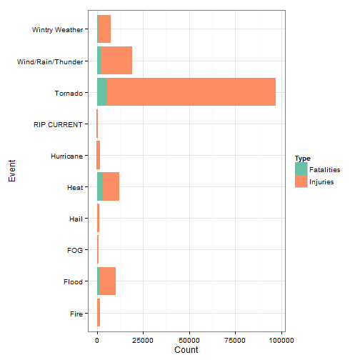
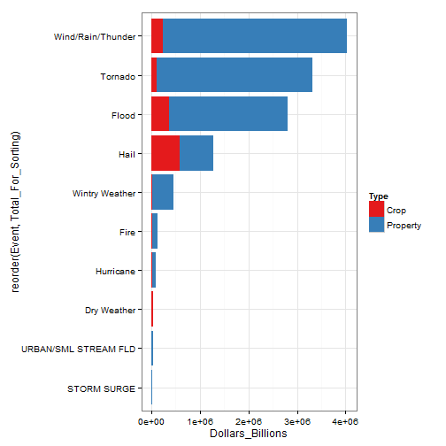

###SYNOPSIS

The aim of this study is to evaluated the most harmful natural disasters in terms of Economic damage and loss of human life.The data is grouped together into major categories and damages for each of those are evaluated seperatly.

According to the analysis tornado have the highest number of injuries per year. Wind/Rain Thunder come a close second

From the economy perspective Wind/Rain/Thunder account for a vast majority of the Economic damages together.Tornadoes come next.(We then calculate the absolute dollar value of property and crop damage as well as total damage
)

###Data Analysis
####Loading and preprocessing the data


```r
options(rpubs.upload.method = "internal")

library(data.table)
```

```
## data.table 1.9.2  For help type: help("data.table")
```

```r
if (!exists('dat'))
  {
    dat = data.table(read.csv('C:/Users/SONY/Documents/repdata-data-StormData.csv', header = T))
    #subset only the columns we need
    dat = subset(dat, select = c("EVTYPE","FATALITIES","INJURIES","PROPDMG","CROPDMG"))
}
```

We check that there are no missing values in fatalities and injuries.


```r
sum(is.na(dat$FATALITIES))
```

```
## [1] 0
```


```r
sum(is.na(dat$INJURIES))
```

```
## [1] 0
```
We then calculate the absolute dollar value of property and crop damage as well as total damage.


```r
str(dat)
```

```
## Classes 'data.table' and 'data.frame':	902297 obs. of  5 variables:
##  $ EVTYPE    : Factor w/ 985 levels "   HIGH SURF ADVISORY",..: 834 834 834 834 834 834 834 834 834 834 ...
##  $ FATALITIES: num  0 0 0 0 0 0 0 0 1 0 ...
##  $ INJURIES  : num  15 0 2 2 2 6 1 0 14 0 ...
##  $ PROPDMG   : num  25 2.5 25 2.5 2.5 2.5 2.5 2.5 25 25 ...
##  $ CROPDMG   : num  0 0 0 0 0 0 0 0 0 0 ...
##  - attr(*, ".internal.selfref")=<externalptr>
```
The definition of these fields are as follows:

EVTYPE: This is the description of the severe weather event - Tornado, flood etc.
FATALITIES: This is the number of fatalities associated with the severe weather event.
INJURIES: This is the number of injuries associated with the severe weather event.
PROPDMGEXP: This is the estimated property damage, in billions of dollars associated with the severe weather event.
CROPDMG: This is the estimated crop damage, in billions of dollars associated with the severe weather event.
However, there is one issue with this dataset - the EVTYPE field is not normalized. Therefore, I will make a function that attempts to normalize the EVTYPE column with more consistent values.


###Data Processing


```r
normalize_events = function(x){
        if(grepl('Flood', x, ignore.case = T)){
                return('Flood')
        }
        if(grepl('Tornado', x, ignore.case = T)){
                return('Tornado')
        }
        if(grepl('Snow|Ice|Wintry|Freez|Blizzard|Cold|Winter', x, ignore.case = T)){
                return('Wintry Weather')
        }
        if(grepl('Thunder|Rain|Wind|Shower|Lightning', x, ignore.case = T)){
                return('Wind/Rain/Thunder')
        }
        if(grepl('Hurricane|Tropical|Typhoon', x, ignore.case = T)){
                return('Hurricane')
        }
        if(grepl('Dry|Drought', x, ignore.case = T)){
                return('Dry Weather')
        }
        if(grepl('Heat|Warm', x, ignore.case = T)){
                return('Heat')
        }
        if(grepl('Hail', x, ignore.case = T)){
                return('Hail')
        }
        if(grepl('Fire', x, ignore.case = T)){
                return('Fire')
        }
        return(x)
}
```


Next the data is summarised by the grouping created


```r
dat_summary = dat[,list(FATALITIES = sum(FATALITIES, na.rm = T), 
                         INJURIES = sum(INJURIES, na.rm=T),
                         PROPDMG = sum(PROPDMG, na.rm=T),
                         CROPDMG = sum(CROPDMG, na.rm = T)), 
                  by = apply(as.data.frame(EVTYPE), 1, normalize_events)]
dat_summary
```

```
##                      apply FATALITIES INJURIES   PROPDMG CROPDMG
##   1:               Tornado       5661    91407 3215749.5  100029
##   2:     Wind/Rain/Thunder       2117    16951 3787717.8  237216
##   3:                  Hail         15     1371  689310.8  581418
##   4:        Wintry Weather       1093     6449  422537.3   24005
##   5:                 Flood       1525     8604 2436131.5  364507
##  ---                                                            
## 271:      STORM SURGE/TIDE         11        5    6777.1     850
## 272:               TSUNAMI         33      129     905.3      20
## 273:           DENSE SMOKE          0        0     100.0       0
## 274: ASTRONOMICAL LOW TIDE          0        0     320.0       0
## 275:      VOLCANIC ASHFALL          0        0       0.0       0
```

Next, I split the dataset into two subsets: (1)Health, which corresponds to fatalities and injuires;

(2)Economic, which corresonds to property and crop damage.

The events for each dataset is sorted by the magnitude of events in descending order (measured by fatalities+injuries, or property+crop damage), and select the top 10 events.

Additionally, the data is reshaped using sql so that it can more easily plotted Explanation of the sql query:

I added the Fatalities and Injuries on top of eachother in order to reshape the dataset so that the type of damage is in a single column instead of two separate columns. This makes it easier to plot
Then the  the Fatalities + Injuries are calculated and sorted that column in descending order so that I can have a stacked bar graph that has the sum of the fatality and injury in descending order.
I have selected the top 20 records as that will yield the top 10 events because there will be two records per event (Fatalities, Injuries)


```r
library(sqldf)
```

```
## Loading required package: gsubfn
## Loading required package: proto
## Loading required package: RSQLite
## Loading required package: DBI
## Loading required package: RSQLite.extfuns
```

```r
Health = sqldf('select * from (
         
                       select apply as Event, "Fatalities " as Type, FATALITIES as Count,
                       FATALITIES + INJURIES as Total_For_Sorting
                       from dat_summary union
               
                       select apply as Event, "Injuries " as Typ, INJURIES as Count,
                       FATALITIES + INJURIES as Total_For_Sorting
                       from dat_summary) tbl
               
               order by Total_For_Sorting desc
               limit 20')
```

```
## Loading required package: tcltk
```

```r
Economic = sqldf('select * from (
                 
                         select apply as Event, "Property" as Type, PROPDMG as Dollars_Billions,
                         PROPDMG + CROPDMG as Total_For_Sorting 
                         from dat_summary union
                         
                         select apply as Event, "Crop" as Type, CROPDMG as Dollars_Billions, 
                         PROPDMG + CROPDMG as Total_For_Sorting 
                         from dat_summary) tbl
                 
                 order by Total_For_Sorting desc
                 limit 20')
```

Across the United States, which types of events (as indicated in the EVTYPE variable) are most harmful with respect to population health?

###Results

```r
library(ggplot2)
ggplot(data= Health, aes(x=Event, Total_For_Sorting, y=Count, fill = Type)) + 
        geom_bar(stat= 'identity') + 
        coord_flip()+theme_bw()+scale_fill_brewer(palette="Set2")
```

 

```r
        labs(title = 'Severe Weather In The US: Top 10 Most Harmful Types of Weather\n Measured by Fatalities & Injuries 1950 - 2011',
             #the axis are flipped because you did coord_flip, so the y label appears to be on x-axis
             y = 'Count (Number of People)', x = 'Type of Weather', fill = 'Type of Harm')
```

```
## $title
## [1] "Severe Weather In The US: Top 10 Most Harmful Types of Weather\n Measured by Fatalities & Injuries 1950 - 2011"
## 
## $y
## [1] "Count (Number of People)"
## 
## $x
## [1] "Type of Weather"
## 
## $fill
## [1] "Type of Harm"
## 
## attr(,"class")
## [1] "labels"
```

Tornadoes cause the most fatalities and injuries in the US and far exceeds any other types of weather in its harmful effects.

Across the United States, which types of events have the greatest economic consequences?


```r
library(scales)
ggplot(data= Economic, aes(x=reorder(Event, Total_For_Sorting), y= Dollars_Billions, fill = Type)) + 
        geom_bar(stat= 'identity') + 
        coord_flip()+theme_bw()+scale_fill_brewer(palette="Set1")
```

 

```r
        #scale_y_continuous(labels = dollar) + 
        labs(title = 'Severe Weather In The US: Top 10 Most Harmful Types of Weather\n Measured by Property And Crop Damage 1950 - 2011',
             #the axis are flipped because you did coord_flip, so the y label appears to be on x-axis
             y = 'Dollars of Damage (Billions)', x = 'Type of Weather', fill = 'Type of Damage')
```

```
## $title
## [1] "Severe Weather In The US: Top 10 Most Harmful Types of Weather\n Measured by Property And Crop Damage 1950 - 2011"
## 
## $y
## [1] "Dollars of Damage (Billions)"
## 
## $x
## [1] "Type of Weather"
## 
## $fill
## [1] "Type of Damage"
## 
## attr(,"class")
## [1] "labels"
```
Thus we can conclude that Wind/Rain Thunder cause the maximum economic damage in terms of Crop damage and Property damage(added up)


--------Thanks for reading-------


Have a good day !!!
